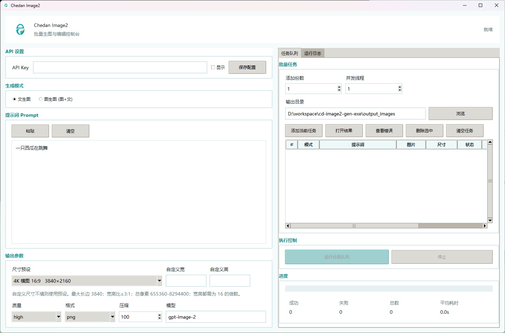

# CD-image2

CD-image2 把 image2 生图流程整理成了三种入口：一个可以直接点开的桌面 GUI、一个给 Codex 使用的 skill，以及一个适合自动化脚本调用的命令行客户端。你可以用它完成文生图、图生图/图片编辑、批量队列、并发生成和本地结果保存。

接口固定访问 `https://sp.chedankj.com/v1`，使用同一个 `image` 分组 API Key。

> API Key 请到 https://www.chedankj.com/ 创建，分组选择 `image`。Key 只建议在 GUI 里运行时填写，或通过环境变量临时传入；不要写进仓库、README、脚本文件或打包配置里。



## 下载安装

### Windows

下载并双击运行：

- [chedan-image2-gui-windows.exe](downloads/chedan-image2-gui-windows.exe)

首次运行后，在 GUI 的 `API 设置` 中填入 API Key，点击 `保存配置` 即可。

### macOS

当前最新版暂不提供预编译的 macOS `.dmg` / `.pkg` 安装包，因为 macOS 应用需要在 macOS 环境中重新构建，Windows 上生成的包不可用。需要 macOS 版本时，请下载自助构建源码包：

- [Chedan-Image2-macOS-build-source.zip](downloads/Chedan-Image2-macOS-build-source.zip)

在 Mac 上解压后运行：

```bash
chmod +x build_macos.sh
./build_macos.sh
```

构建完成后会生成：

- `dist/Chedan Image2.app`
- `dist/Chedan-Image2-macOS-app.zip`
- `dist/Chedan-Image2-macOS.dmg`
- `dist/Chedan-Image2-macOS.pkg`

也可以直接在 GitHub Actions 里手动运行 `Build macOS App`，由 GitHub 的 macOS runner 生成安装包。如果 macOS 提示应用未签名，请右键应用选择 `打开`，再确认打开。

### Codex Skill

下载 skill 压缩包：

- [chedan-image2-skill.zip](downloads/chedan-image2-skill.zip)

也可以直接使用仓库里的 skill 源码目录：

- [cd-image2/SKILL.md](cd-image2/SKILL.md)
- [cd-image2/scripts/image2_cli.py](cd-image2/scripts/image2_cli.py)

校验文件：

- [SHA256SUMS.txt](downloads/SHA256SUMS.txt)

## GUI 界面功能

- `API 设置`：输入、显示/隐藏、保存 image2 API Key。
- `生成模式`：支持 `文生图` 和 `图生图 (图+文)`。
- `输入图片`：图生图模式可选择单张或多张图片；多图会自动拼合为接口输入图。
- `提示词 Prompt`：支持粘贴、清空、长文本提示词。
- `输出参数`：支持 1K/2K/4K 常用尺寸、自定义宽高、`auto`、质量、输出格式和压缩。
- `批量任务`：把当前参数加入任务队列，可设置添加份数、并发线程和输出目录。
- `任务队列`：展示每个任务的状态、结果路径和错误原因；双击可打开结果或查看错误。
- `运行日志`：实时显示提交、重试、完成和接口错误。

尺寸规则由接口约束决定：

- 长边不超过 `3840`。
- 宽和高都必须是 `16` 的倍数。
- 宽高比不超过 `3:1`。
- 总像素在 `655360` 到 `8294400` 之间。
- 例如 `3840x2464` 的总像素是 `9461760`，超过上限，所以会在本地被拦截；可改用 `3840x2160`、`2160x3840` 或 `2048x2048`。

## Codex Skill 用法

`cd-image2` skill 适合让 Codex 在对话中直接调用 image2 生图或修图。skill 内置了这些规则：

- 固定访问 `https://sp.chedankj.com/v1`。
- 通过 `scripts/image2_cli.py` 调用接口。
- Key 只从本轮命令的环境变量读取，优先使用 `IMAGE2_API_KEY`。
- 自动区分 `generate` 文生图和 `edit` 图片编辑。
- 4K 或自定义尺寸会先校验接口尺寸规则。
- 对 `502/504/522/524` 网关和超时错误进行重试。

安装后可以这样请求 Codex：

```text
使用 $cd-image2 生成一张 2048x2048 的商品海报，风格干净高级。
```

如果当前对话没有 image 分组 Key，skill 会先要求用户提供 Key，而不是继续发送请求。

## 脚本方案 3：直接访问 image2

脚本位于 [cd-image2/scripts/image2_cli.py](cd-image2/scripts/image2_cli.py)，适合自动化流程、批处理或在 Codex skill 外单独调用。它使用 `httpx`，并固定调用 image2 的 OpenAI 兼容接口。

安装依赖：

```powershell
python -m pip install -r requirements.txt
```

设置 Key：

```powershell
$env:IMAGE2_API_KEY="sk-..."
```

文生图：

```powershell
python .\cd-image2\scripts\image2_cli.py generate "一张干净的科技产品海报，白色背景，高级摄影光线" --size 2048x2048 --quality high --slug product-poster --timeout 600
```

图生图/图片编辑：

```powershell
python .\cd-image2\scripts\image2_cli.py edit "保留主体结构，把背景改成纯白电商主图风格" --input .\source.png --size 2048x2048 --quality high --slug edited-main-image
```

常用参数：

- `--size`：输出尺寸，例如 `1024x1024`、`2048x2048`、`3840x2160`。
- 脚本会在请求前校验尺寸，`3840x2464` 这类总像素超过 `8294400` 的尺寸不会发送到接口。
- `--quality`：`low`、`medium`、`high` 或 `auto`。
- `--count`：生成多张图片。
- `--output-dir`：保存目录。
- `--slug`：输出文件名前缀。
- `--timeout`：请求超时时间，建议 2K/4K 使用 `600` 秒。

接口对应关系：

- `generate` 调用 `/images/generations`，使用 JSON 请求体。
- `edit` 调用 `/images/edits`，使用 multipart 上传输入图。
- 响应兼容 `b64_json` 和 `url`：如果接口返回 URL，会先下载图片，再保存到本地输出路径。

## 从源码运行

```powershell
python -m pip install -r requirements.txt
python .\chedan_image2_gui.py
```

也可以通过环境变量临时传入 Key：

```powershell
$env:IMAGE2_API_KEY="sk-..."
python .\chedan_image2_gui.py
```

## 打包

Windows：

```powershell
.\build_windows.ps1
```

输出：

- `dist/chedan-image2-gui.exe`

macOS 需要在 macOS 上构建：

```bash
chmod +x build_macos.sh
./build_macos.sh
```

输出：

- `dist/Chedan Image2.app`
- `dist/Chedan-Image2-macOS-app.zip`
- `dist/Chedan-Image2-macOS.dmg`
- `dist/Chedan-Image2-macOS.pkg`

仓库也包含 GitHub Actions 工作流，可以在 Actions 页手动运行 `Build macOS App`。

## 项目结构

```text
.
├── chedan_image2_gui.py              # Tkinter GUI
├── cd-image2/                        # Codex skill 源码
│   ├── SKILL.md
│   ├── agents/openai.yaml
│   └── scripts/image2_cli.py
├── downloads/                        # Windows 包、macOS 自助构建包和 skill zip
├── build_windows.ps1                 # Windows 打包脚本
├── build_macos.sh                    # macOS 打包脚本
├── chedan-image2-gui.spec            # Windows PyInstaller 配置
├── chedan-image2-gui-macos.spec      # macOS PyInstaller 配置
├── requirements.txt
└── config.example.ini
```

## 注意事项

- 不要提交真实 API Key，`config.ini` 已被 `.gitignore` 忽略。
- 4K 任务较慢，接口可能返回 `502/504/522/524`，脚本和 GUI 会重试，但仍可能受上游容量影响。
- `503 No available compatible accounts` 通常表示当前通道没有可用账号，或 Key/分组权限不匹配。
- 未签名的 macOS 应用首次打开会触发 Gatekeeper 提示，这是正常现象。
